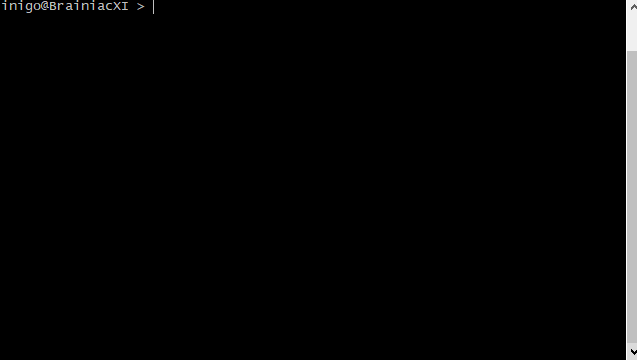

# kafka-bash-completion
Bash programmable completions for the Kafka commands.

## Why?

Just because I am a bit tired of (mis)typing options in Kafka.

For some software we can just start typing the comand and press "tab" "tab" to get a reasonable list of completions; but not for Kafka... yet.

## Kafka 1.0 supported shell scripts

- [X] connect-distributed.sh
- [X] connect-standalone.sh
- [X] kafka-acls.sh
- [X] kafka-broker-api-versions.sh
- [X] kafka-configs.sh
- [X] kafka-console-consumer.sh
- [X] kafka-console-producer.sh
- [X] kafka-consumer-groups.sh
- [X] kafka-consumer-perf-test.sh
- [X] kafka-delete-records.sh
- [X] kafka-log-dirs.sh
- [X] kafka-mirror-maker.sh
- [X] kafka-preferred-replica-election.sh
- [X] kafka-producer-perf-test.sh
- [X] kafka-reassign-partitions.sh
- [X] kafka-replay-log-producer.sh
- [X] kafka-replica-verification.sh
- [X] kafka-run-class.sh
- [X] kafka-server-start.sh
- [X] kafka-server-stop.sh
- [X] kafka-simple-consumer-shell.sh
- [X] kafka-streams-application-reset.sh
- [X] kafka-topics.sh
- [X] kafka-verifiable-consumer.sh
- [x] kafka-verifiable-producer.sh

No support for this:

- [ ] trogdor.sh
- [ ] zookeeper-security-migration.sh
- [ ] zookeeper-server-start.sh
- [ ] zookeeper-server-stop.sh
- [ ] zookeeper-shell.sh
